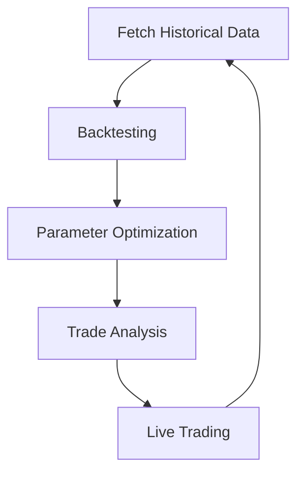

# Traider

## 🧠 Overview

Traider is an automated crypto trading bot for Binance, built around a dynamic, risk-managed hybrid strategy. It features:
- **Dynamic Strategy Selection:** Switches between breakout and grid trading based on market volatility (ATR).
- **Breakout Strategy:** Captures trends with market orders protected by OCO Stop-Loss and Take-Profit.
- **Grid Strategy:** Accumulates positions in sideways markets with a ladder of limit orders.
- **Sentiment Analysis:** Filters and enhances trades using real-time news and social sentiment.
- **Dynamic Position Sizing:** Calculates order size based on a fixed percentage of your account balance.
- **Backtesting Engine:** Realistic simulation with slippage, latency, exchange constraints, drawdown, trade limits, and sentiment integration.

---

## 📦 Features

- Binance API live trading support
- Dynamic strategy selection using ATR
- Breakout and grid trading
- Dynamic position sizing
- Sentiment filter for risk management
- Realistic backtesting engine (fees, slippage, latency, exchange rules)
- Parameter optimization with Optuna
- Automated unit tests for reliability

---

## ⚙️ Installation

1. Clone the repo:
    ```bash
    git clone https://github.com/iyeque/Traider.git
    cd Traider
    ```
2. Install dependencies:
    ```bash
    pip install -r requirements.txt
    ```
3. Create your .env file:
    ```bash
    cp .env.example .env
    ```
4. Add your API keys and configure your strategy in the `.env` file.

---

## 💻 Running the Bot

### With Docker (Recommended)
```bash
docker-compose up -d
```
View logs:
```bash
docker-compose logs -f
```

### Natively
```bash
python main.py
```

---

## 🔄 Backtesting & Optimization Workflow

For robust strategy evaluation, follow this workflow:
1. **Fetch Historical Data:**
   - Run `data_acquisition/fetch_historical_data.py` to gather and process historical price and sentiment data from multiple sources.
2. **Run Backtest:**
   - Use `backtest/backtest.py` to simulate trading strategies on the historical data, incorporating sentiment and realistic exchange constraints.
3. **Optimize Parameters:**
   - Use `backtest/optimize_params.py` to systematically search for the best strategy parameters using Optuna, based on backtest results. This step may generate detailed trade logs for top-performing strategies.
4. **Analyze Trades (Optional):**
   - Use `backtest/analyze_trades.py` to further analyze trade logs and results produced during optimization. This helps you understand which parameter sets performed best and why.

### Visual Overview


This flow ensures your strategies are tested on realistic data before live deployment.

---

## 🧪 Automated Testing

Unit tests are provided for core modules to ensure reliability and correctness:
- `bot/test_strategy.py`: Tests the signal generation logic in `strategy.py`.
- `bot/test_trading.py`: Tests the trade execution logic in `trading.py`.

Run all tests before deploying or running the bot to catch bugs early:
```bash
python -m unittest discover bot
```

---

## 📁 Project Structure

```bash
traider/
├── bot/
│   ├── strategy.py        # Signal generator & indicators (RSI, MACD, ATR)
│   ├── trading.py         # Executes trades with SL/TP
│   ├── grid.py            # Grid ladder logic
│   ├── sentiment_engine.py# Sentiment analysis
│   ├── test_strategy.py   # Unit tests for strategy
│   ├── test_trading.py    # Unit tests for trading
├── backtest/
│   ├── backtest.py        # Backtesting engine
│   ├── optimize_params.py # Parameter optimization
│   ├── analyze_trades.py  # Trade analysis (used after optimization)
├── data_acquisition/      # Scripts for fetching and processing historical data
│   ├── fetch_historical_data.py
├── .env.example           # Example environment variables
├── .env                   # Your environment variables (ignored by git)
├── Dockerfile
├── docker-compose.yml
├── main.py                # Main bot runner
├── requirements.txt
└── README.md
```

---

## 🔐 Security Notes

- Never commit your `.env` file or API keys.
- Always use IP whitelisting on the Binance API.
- Start with small amounts for live testing or use the Binance testnet.

---

## 🛡️ Disclaimer

This is NOT financial advice. You are fully responsible for your own trades, wins, and losses. Use it at your own risk.